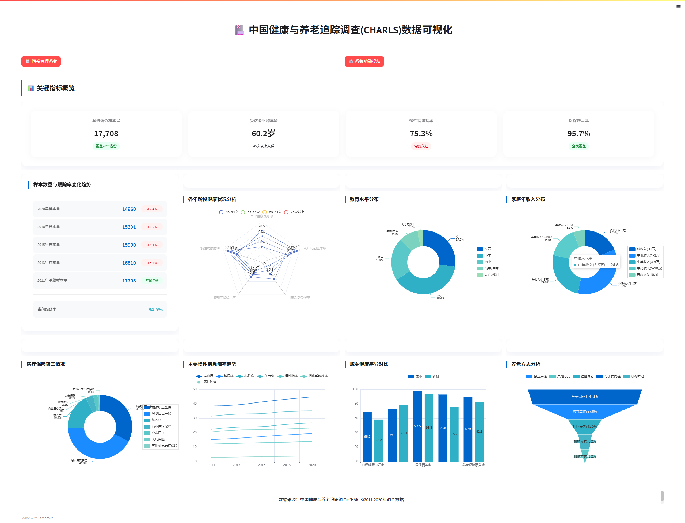

# CHARLS数据可视化系统 | CHARLS Data Visualization System

[](https://www.python.org)
[](https://streamlit.io)
[](https://opensource.org/licenses/MIT)

[English](#english) | [中文](#chinese)

<h2 id="chinese">项目介绍</h2>

中国健康与养老追踪调查(CHARLS)数据可视化系统是一个基于Streamlit的交互式数据可视化平台，用于展示和管理CHARLS调查数据，包含多维度健康指标分析、问卷管理功能和系统功能模块。

### 📸 系统截图


### ✨ 主要特性

- 📊 多维度数据可视化
  - 样本数量与跟踪率变化趋势
  - 各年龄段健康状况分析
  - 教育水平分布
  - 家庭年收入分布
  - 医疗保险覆盖情况
  - 主要慢性病患病率趋势
  - 城乡健康差异对比
  - 养老方式分析

- 📋 问卷管理系统
  - 问卷数据的添加、编辑、删除功能
  - 分页展示问卷列表
  - 直观的数据卡片展示

- ⚙️ 系统功能模块
  - 多个核心功能模块概览与详情
  - 系统信息摘要与状态监控
  - 功能模块状态跟踪（已上线/开发中/计划中）
  - 系统使用统计和性能监控
  - 数据备份与系统维护功能

- 📈 关键指标概览
  - 基线调查样本量
  - 受访者平均年龄
  - 慢性病患病率
  - 医保覆盖率

### 🛠️ 技术栈

- Python 3.7+
- Streamlit
- Plotly
- Pandas
- Numpy
- PyEcharts
- Streamlit-Echarts

### 🚀 快速开始

1. 克隆仓库
```bash
git clone https://github.com/MilesSG/charls-data-visualization.git
cd charls-data-visualization
```

2. 安装依赖
```bash
pip install -r requirements.txt
```

3. 运行应用
```bash
streamlit run app.py
```

### 🔄 最近更新

- 2023-03-06: 添加系统功能模块，提供系统状态监控和功能概览
- 2023-02-15: 更新2020年CHARLS数据集
- 2022-11-20: 新增健康指标横向对比功能
- 2022-09-05: 更新数据清洗算法

---

<h2 id="english">Project Introduction</h2>

The China Health and Retirement Longitudinal Study (CHARLS) Data Visualization System is a Streamlit-based interactive platform for visualizing and managing CHARLS survey data, featuring multi-dimensional health indicators analysis, questionnaire management, and system function modules.

### 📸 Screenshots


### ✨ Key Features

- 📊 Multi-dimensional Data Visualization
  - Sample Size and Tracking Rate Trends
  - Health Status Analysis by Age Groups
  - Education Level Distribution
  - Annual Household Income Distribution
  - Medical Insurance Coverage
  - Chronic Disease Prevalence Trends
  - Urban-Rural Health Disparities
  - Elderly Care Methods Analysis

- 📋 Questionnaire Management System
  - CRUD Operations for Survey Data
  - Paginated Survey List
  - Intuitive Data Card Display

- ⚙️ System Function Modules
  - Overview and details of multiple core function modules
  - System information summary and status monitoring
  - Function module status tracking (Active/In Development/Planned)
  - System usage statistics and performance monitoring
  - Data backup and system maintenance functions

- 📈 Key Metrics Overview
  - Baseline Survey Sample Size
  - Average Age of Respondents
  - Chronic Disease Prevalence
  - Medical Insurance Coverage Rate

### 🛠️ Tech Stack

- Python 3.7+
- Streamlit
- Plotly
- Pandas
- Numpy
- PyEcharts
- Streamlit-Echarts

### 🚀 Quick Start

1. Clone Repository
```bash
git clone https://github.com/MilesSG/charls-data-visualization.git
cd charls-data-visualization
```

2. Install Dependencies
```bash
pip install -r requirements.txt
```

3. Run Application
```bash
streamlit run app.py
```

### 🔄 Recent Updates

- 2023-03-06: Added System Function Modules for status monitoring and feature overview
- 2023-02-15: Updated 2020 CHARLS dataset
- 2022-11-20: Added health indicators comparative analysis
- 2022-09-05: Updated data cleaning algorithms

---

### 📝 License

This project is licensed under the MIT License - see the [LICENSE](LICENSE) file for details.

### 👨‍💻 Author

MilesSG
